<h1 align="center">Neural Computers (The Data Pipeline)</h1>

<p align="center">
  <a href="https://metauto.ai/neuralcomputer/">
    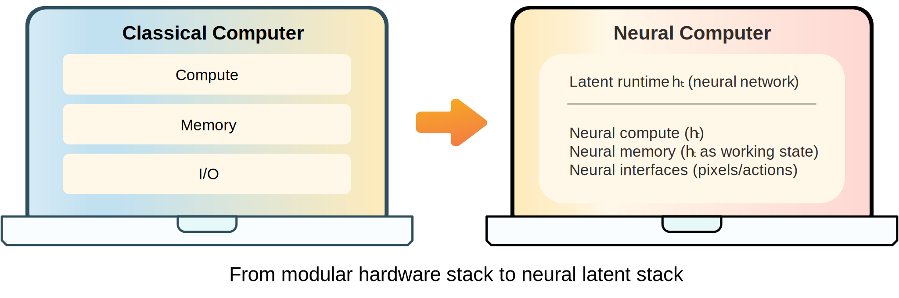
  </a>
</p>

<p align="center">
  <a href="https://metauto.ai/neuralcomputer/">📘 Blog</a>
  &nbsp;&nbsp;·&nbsp;&nbsp;
  <a href="https://metauto.ai/neuralcomputer/">🎬 Demo Gallery</a>
  &nbsp;&nbsp;·&nbsp;&nbsp;
  <a href="https://arxiv.org/search/?query=Neural+Computers+Mingchen+Zhuge&searchtype=all&source=header">📄 Paper</a>
</p>

## News

- **2026 April**: First open-source release of Neural Computers, starting with the data pipeline for CLI and GUI trajectory generation.

## Abstract

Neural Computers (NCs) are neural networks that unify computation, memory, and I/O in a single latent runtime state. The long-term goal is the Completely Neural Computer (CNC): a general-purpose neural computer that challenges the layered architecture of conventional computers. As an initial step, this project studies whether executable dynamics can be learned solely from collected I/O traces, without access to instrumented program state, using CLI and GUI trajectories as training and evaluation data.

## Quick Start

**Environment** `Python 3.9+` · `Docker` · `asciinema` · `agg` · `ffmpeg`

**1. CLI / Asciinema**
```bash
python3 main.py cligen asciinema record --command "python3 --version"
python3 main.py cligen asciinema cast-to-mp4 workspace/cligen_general/casts
```

**2. CLI / VHS**
```bash
python3 main.py cligen vhs build-image
python3 main.py cligen vhs generate-basic --count 10 --prefix demo
python3 main.py cligen vhs make-manifest
python3 main.py cligen vhs run-manifest
```

**3. GUI / Synthetic**
```bash
pip install -r engine/gui/synthetic_data_collection/requirements.txt
python3 main.py guiworld build-image
python3 main.py guiworld synthetic --count 1 --max-workers 1
```

### Runtime Generations from Neural Computers

<p><sub>Using training data generated by the code released in this repository.</sub></p>

**CLIGen (general / asciinema)**

<table>
  <tr>
    <td>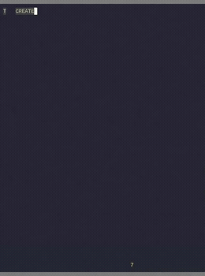</td>
    <td>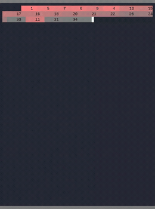</td>
    <td>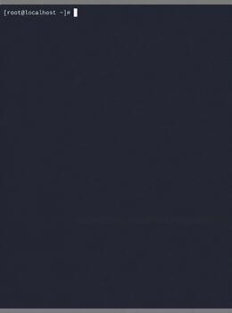</td>
    <td>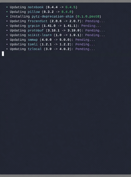</td>
    <td>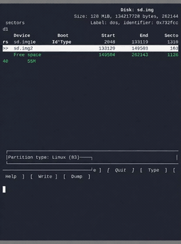</td>
    <td>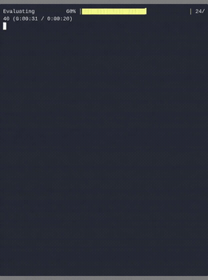</td>
  </tr>
</table>

**CLIGen (clean / vhs)**

<table>
  <tr>
    <td></td>
    <td></td>
    <td></td>
    <td></td>
    <td></td>
    <td></td>
  </tr>
</table>

**GUIWorld (GUI)**

<p><sub>Alternating: Conventional Computer / Neural Computer</sub></p>

<table>
  <tr>
    <td>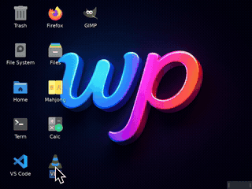</td>
    <td></td>
    <td>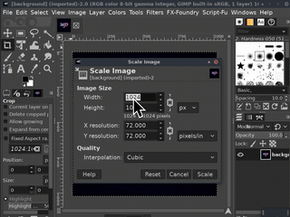</td>
    <td>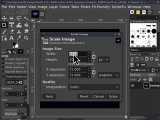</td>
    <td>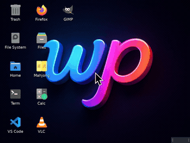</td>
    <td>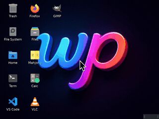</td>
  </tr>
</table>

###  Acknowledge 


Our models (not released here) are built from [Wan2.1](https://github.com/Wan-Video/Wan2.1) and [Matrix-Game-2](https://github.com/SkyworkAI/Matrix-Game). The data engine for CLIGen (General) is built from [Asciinema](https://github.com/search?q=asciinema&type=repositories), the data engine for CLIGen (Clean) is from [VHS](https://github.com/search?q=vhs&type=repositories), the data engine for GUIWorld (Random) is modified directly from [Neural-OS](https://neural-os.com/), and the data engine for GUIWorld (CUA) is built according to [Claude CUA](https://github.com/anthropics/claude-quickstarts/tree/main/computer-use-demo).

| Data Engine | Source |
|---|---|
| CLIGen (General) | [Asciinema](https://github.com/search?q=asciinema&type=repositories) |
| CLIGen (Clean) | [VHS](https://github.com/search?q=vhs&type=repositories) |
| GUIWorld (Random) | [Neural-OS](https://neural-os.com/) |
| GUIWorld (CUA) | [Claude CUA](https://github.com/anthropics/claude-quickstarts/tree/main/computer-use-demo) |
